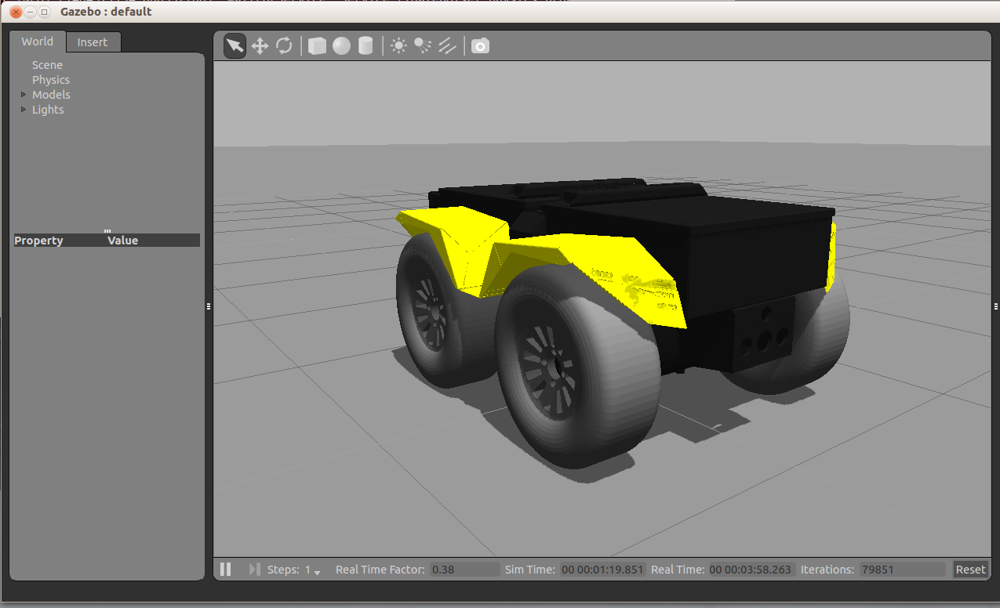
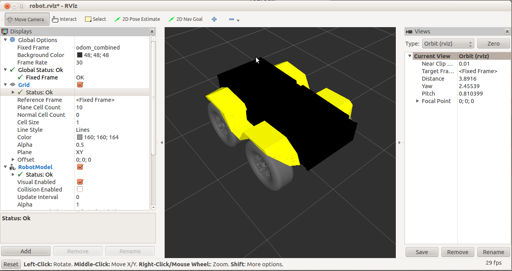

Drive a Grizzly
================

.. warning::
	Grizzly is a discontinued platform.  Please see :doc:`Drive a Husky <Drive a Husky>` for a currently-supported robot.

	This page is presented for legacy information only.
	

Updating the Virtual Machine
------------------------------
Open a terminal window (Ctrl + Alt + T), and enter the following:

.. parsed-literal::
	sudo apt-get update
	sudo apt-get install ros-kinetic-grizzly-simulator
	sudo apt-get install ros-kinetic-grizzly-desktop
	sudo apt-get install ros-kinetic-grizzly-navigation

Running a Virtual Grizzly
--------------------------

Open a terminal window, and enter:

.. parsed-literal::
	roslaunch grizzly_gazebo grizzly_empty_world.launch

Open another terminal window, and enter:

.. parsed-literal::
	roslaunch grizzly_viz view_robot.launch

You should be given two windows, both showing a yellow, rugged robot (Grizzly!). The left one shown is Gazebo.
This is where we get a realistic simulation of our robot, including wheel slippage, skidding, and inertia.
We can add objects to this simulation, or even entire maps of real places.

This window below is RViz. This tool allows us to see sensor data from a robot, and give it commands (in a future post). RViz is a more simplified simulation in the interest of speed.

We can now command the robot to go forwards. Open a terminal window, and copy the following:

.. parsed-literal::
	rostopic pub /cmd_vel geometry_msgs/Twist "linear:
		x: 0.5
		y: 0.0
		z: 0.0
	angular:
		x: 0.0
		y: 0.0
		z: 0.0"

In the above command, we publish to the cmd_vel topic, of topic type **geometry_msgs/Twist**.
The data we publish tells the simulated Grizzly to go forwards at 0.5m/s, without any rotation.
You should see your Grizzly move forwards. In the gazebo window, you might also notice simulated wheel slip, and skidding.
