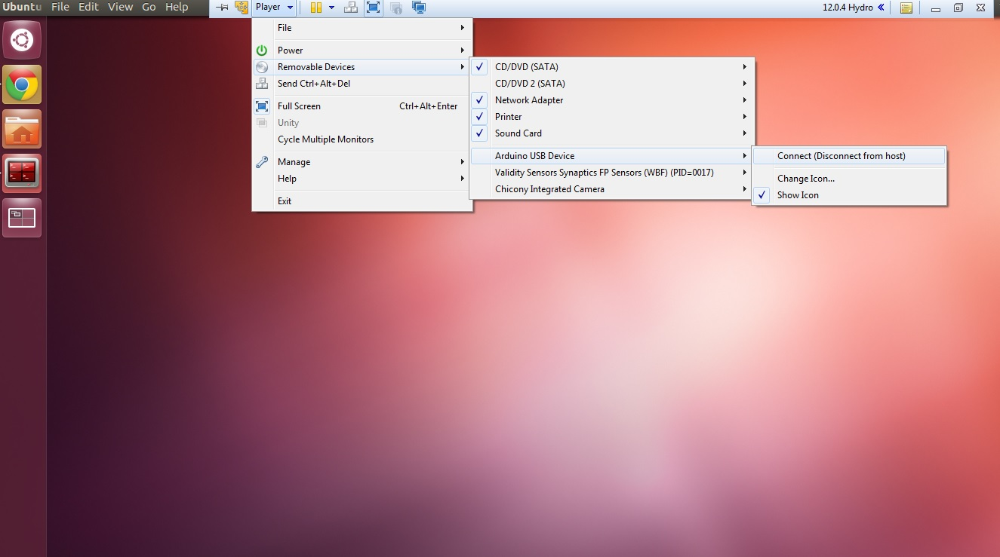

Driving Husky with ROSserial and an Arduino
=============================================

The Arduino family of micro controllers has quickly become a go to board for hobbyist due to its simplicity and ease of use, however often times roboticists must create communication protocols to allow their embedded hardware to communicate with a computer. That's where rosserial comes in! Rosserial is a general protocol for sending ROS messages over a serial interface, such as the UART on Arduino. This allows you to easily interface any sensors attached to Arduino into your ROS environment!

This tutorial will get you started  by setting up the Arduino IDE and installing the rosserial libraries. Then, we'll test it out by driving the Husky simulation using a neat trick with the Arduino board. It should goes without saying you'll need an Arduino to complete this tutorial. We'll also be using a Husky simulator, so make sure to run through our :doc: `Drive a Husky <Drive a Husky>`_ tutorial if you haven't done so yet.

Setup
------

The first step is to set up your Arduino environment, begin by installing the Arduino IDE and rosserial using:

.. code-block:: bash

  sudo apt-get install arduino arduino-core ros-hydro-rosserial ros-hydro-rosserial-arduino

Once you open up the Arduino IDE for the first time, a directory named "sketchbook" will be created in your home directory. Now we need to import the rosserial library into your arduino IDE. If your sketchbook directory is empty, you may need to create a directory named "libraries" inside of it.

.. code-block:: bash

  mkdir ~/sketchbook/libraries
  cd ~/sketchbook/libraries
  rosrun rosserial_arduino make_libraries.py .

Restart your Arduino IDE and you should see the ros_lib part of your libraries!

.. image:: graphics/ros_lib_check.png
    :scale: 50 %

You'll want to ensure that your Ubuntu user is part of the "Dailout" group, which grants you access to serial ports. You can check by using

.. code-block:: bash

  groups $(whoami)

If you don't see ``dailout``, you can easily add yourself using

.. code-block:: bash

  sudo usermod -a -G dialout $(whoami)

After running ``sudo usermod <...>`` you will need to log out and log back in again for the changes to your user account to take effect.

One last step to make our lives easier will be to create udev rules so your Arduino is  recognized when plugged in and the correct permissions are set. For more information on udev rules check out our udev article . Begin by plugging in your Arduino.

**NOTE:** If you are using a virtual machine, you will have to connect Arduino to the virtual machine after plugging it in.

You can confirm your system is actually connected to Arduino by running

.. code-block:: bash

  ls -l /dev

You should see a line similar to

.. code-block:: bash

  Bus 002 Device 005: ID 2341:0043

To confirm this is indeed your Arduino, disconnect it and run the command again, taking note which entry has disappeared. Remember the ID numbers, in this case, 2341 is the vendor ID and 0043 is the product ID. Now venture over to your udev rules at:

.. code-block:: bash

  cd /etc/udev/rules.d/

and create our new rules file, the naming conventions for rules files follows "##-name.rules". Chose a number that isn't in use!

.. code-block:: bash

  sudo gedit 97-arduino.rules

Copy the following into your new rules file, replacing #### with your product ID and vendor ID. For more information about what these tags mean, check out our article on udev rules.

.. code-block:: bash

  SUBSYSTEMS=="usb", ACTION=="add", ATTRS{idVendor}=="2341", ATTRS{idProduct}=="00[0-f][0-f]", MODE="0666", SYMLINK+="arduino arduino_$attr{serial}", GROUP="dialout",

All that is left is to update your udev rules and reboot your system

.. code-block:: bash

  sudo udevadm control --reload-rules && sudo service udev restart && sudo udevadm trigger

You should now see "arduino" as an entry in ls -l /dev with full permissions! (rw-rw-rw-)

Code
-----

We're now set to upload our code to Arduino! The code is fairly straight forward, however if you have any difficulties following along, check out our "Creating a publisher" tutorial. Copy the following code into the Arduino IDE and click upload. If your udev rules were set correctly you should be able to upload without any errors.

If you encounter any errors, verify your arduino is coming up as "arduino" in a ls -l /dev and proper permissions are set. You may also have to point the Arduino IDE towards the correct USB port in tools -> serial port.

.. code-block:: bash

  #include <ArduinoHardware.h>
  #include <ros.h>
  #include <geometry_msgs/Twist.h>

  ros::NodeHandle nh;

  geometry_msgs::Twist msg;

  ros::Publisher pub("husky/cmd_vel", &msg);

  void setup()
  {
   nh.initNode();
   nh.advertise(pub);
  } void loop()
  {
   if(digitalRead(8)==1)
   msg.linear.x=-0.25;

  else if (digitalRead(4)==1)
  msg.linear.x=0.25;

  else if (digitalRead(8)==0 && digitalRead(4)==0)
  msg.linear.x=0;

  pub.publish(&msg);
  nh.spinOnce();
  }

Driving Husky
-------------

Now that Arduino is loaded with our code and publishing velocity commands, we can pass these messages along into our ROS environment. We'll start by launching a Husky simulation:

.. code-block:: bash

  roslaunch husky_gazebo husky_empty_world.launch

All that's left is to attach the Arduino into our ROS environment using:

.. code-block:: bash

  rosrun rosserial_python serial_node.py _port:=/dev/arduino

We're ready to try it out! Go ahead and touch the digital pin 8 and you should see Husky drive forward! Similarly if you touch digital pin 4 Husky will drive backwards.

.. image:: graphics/ArduinoUno_r2_front450px.jpg

This trick is made possible by a phenomenon known as `parasitic capacitance <http://en.wikipedia.org/wiki/Parasitic_capacitance>`_, which is usually an unwanted effect in electronics design, but serves nicely for the purpose of our example. That being said, this isn't the most reliable method, and is intended to provide a simple example with minimal equipment.  If you are having difficulties moving your simulated Husky, try using rostopic echo /husky/cmd_vel to verify some commands are in fact being sent to Husky when you touch the pins.

Be sure to go through the rest of our ROS tutorials on our `knowledge base <http://support.clearpathrobotics.com/>`_. If you want to learn more about ROSserial, be sure to visit the rosserial page of the `ROS wiki <http://wiki.ros.org/rosserial>`_.
