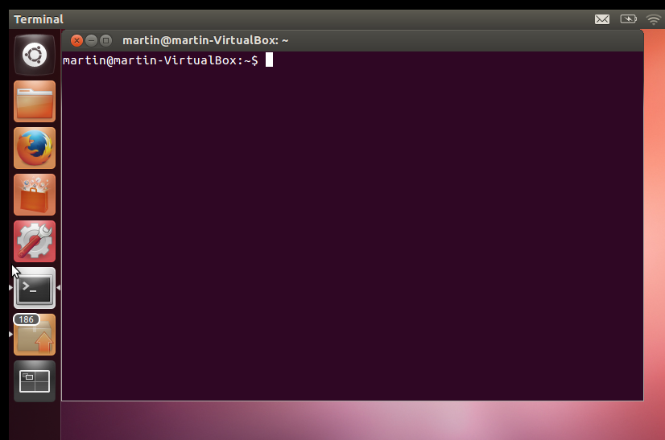

Getting Started with Ubuntu
=============================

To learn how to use ROS, we must first learn the basics of Ubuntu! Ubuntu is a Linux based open source operating system. The bulk of development will be done using the terminal. You can open up a terminal window by clicking the terminal icon or by typing "terminal" in the start menu.

To use the terminal, simply type in a command in the window and push ENTER. When working in a terminal, the directory you are currently located in is called the "working directory" and shown at the start of the terminal line.  Below are some common commands you will encounter throughout this tutorial.  You may see a command presented like this: ``command <parameters>``.  Anything between the ``<...>`` (including the ``<`` and ``>`` characters themselves) should be replaced before pressing ENTER.

=============================== ============================================================================================================
Command                         Description
=============================== ============================================================================================================
``ls``                          Lists files and folders in the current working directory
``ls <folder>``                 Lists files and folders in a specific directory
``cd <folder>``                 Change directory (cd) to <folder> (switch to a new working directory)
``pwd``                         Prints the current working directory
``cp <src><dest>``              Copies <src> to <dest>
``mkdir <directory>``           Creates a directory in your working directory named <directory>
``gedit <file>``                Opens a GUI text editor to edit <file>
``nano <file>``                 Opens a basic text editor in the terminal to edit <file>
``rm <file>``                   Deletes <file>. You cannot recover the file once it has been deleted!
``rm -rf <folder>``             Deletes <folder> and all its contents.  You cannot recover the deleted files once they're gone!
``mv <src> <dest>``             Moves (or renames) <src> to <dest>
``sudo <command>``              Executes the command as the superuser (root), allowing you to modify, create, or delete system files
``echo $<ENV_VAR>``             Print an environment variable.  For example ``echo $ROS_MASTER_URI`` will print the URI of the ROS master.  (We'll cover more about what ROS master is in the next section.)
``export <ENV_VAR>=<value>``    Assign a new value to an environment variable.  For example, to connect to the ROS master on a remote computer you could run ``export ROS_MASTER_URI=http://remote-host:11311``
``source <file>``               Load a file containing environment variables and apply them to the current terminal.  e.g. ``source /opt/ros/kinetic/setup.bash``
=============================== ============================================================================================================

There are certain special characters that can be used in the terminal to make life easier.

===================== ============================================================================================================
Character(s)          Description
===================== ============================================================================================================
``~``                 Expands to the user's home folder (``/home/<your-username>``).  $HOME does the same thing
``.``                 The current directory.  For example ``ls ."`` will print the contents of the current directory
``..``                The parent directory.  To move higher up the directory tree you can use ``cd ..``
``&``                 Placed at the end of a command to run it in the background.  e.g. ``gedit <file> &``
``*``                 Wildcard for matching files.  e.g. ``ls *.png`` will list all PNG files in the current directory
``$(<command>)``      Executes the internal command and replaces the ``$(...)`` portion with the output of the inner command.  e.g. ``sudo sh -c 'echo "deb http://packages.ros.org/ros/ubuntu $(lsb_release -sc) main" > /etc/apt/sources.list.d/``
===================== ============================================================================================================

Some common shortcuts for the terminal:

===================== ============================================================================================================
Shortcut              Description
===================== ============================================================================================================
**ctrl+c**            Cancel the current application that's running
**ctrl+d**            Output the End of File character.  Used to close the terminal
**ctrl+shift+t**      Open a new tab in the terminal window
**shift+insert**      Paste the contents of the clipboard
**ctrl+shift+v**      Paste the contents of the clipboard
**ctrl+shift+c**      Copy the text currently highlighted in the terminal.  Note that ctrl+c to copy will *not* work, as that shortcut cancels the current operation.
**up/down arrows**    Scroll through recent commands
**tab**               Try to auto-complete the current command.
===================== ============================================================================================================

Ubuntu programs are installed from repositories.  A repository is a specially-structured server that contains Debian (.deb) *packages*.  A package can contain data files, executable programs, scripts, source code, image, videos, or any other kind of file. This allows for very easy installation and updating of programs and files on your computer. To install a package, simply type

.. code-block:: bash

    sudo apt-get install <package-name>

ROS packages will be named ``ros-*``. For example, to install Clearpath Robotics' ROS |ros_distro| Husky packages you would use:

.. parsed-literal::

	sudo apt-get install ros-|ros_distro|-husky-desktop

A very convenient feature of Ubuntu is tab auto completion! While typing a command, press the tab key to complete the rest of the command. If there are multiple commands that could be used to finish your line, double tap the tab key to list the possible options.

You should now have the tools you need to install ROS on your machine! Instructions can be found on the `ROS Wiki <http://wiki.ros.org>`_.
