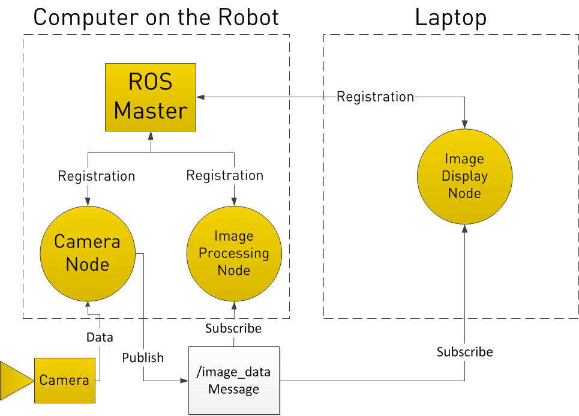

Intro to ROS
==============

What is ROS?
------------
ROS (Robot Operating System) is a BSD-licensed system for controlling robotic components from a PC.
A ROS system is comprised of a number of independent nodes, each of which communicates with the other
nodes using a publish/subscribe messaging model. For example, a particular sensor’s driver might be implemented as a node,
which publishes sensor data in a stream of messages. These messages could be consumed by any number of other nodes,
including filters, loggers, and also higher-level systems such as guidance, pathfinding, etc.

Why ROS?
--------

Note that nodes in ROS do not have to be on the same system (multiple computers) or even of the same architecture!
You could have a Arduino publishing messages, a laptop subscribing to them, and an Android phone driving motors.
This makes ROS really flexible and adaptable to the needs of the user. ROS is also open source, maintained by many people.

General Concepts
----------------

Let’s look at the ROS system from a very high level view. No need to worry how any of the following works, we will cover that later.

ROS starts with the ROS Master. The Master allows all other ROS pieces of software (Nodes) to find and talk to each other.
That way, we do not have to ever specifically state “Send this sensor data to that computer at 127.0.0.1.
We can simply tell Node 1 to send messages to Node 2.

.. image:: graphics/ros101one.png
  :scale: 75%

How do Nodes do this? By publishing and subscribing to Topics.

Let’s say we have a camera on our Robot. We want to be able to see the images from the camera, both on the Robot itself, and on another laptop.

In our example, we have a Camera Node that takes care of communication with the camera, a Image Processing Node on the robot that process image data,
and a Image Display Node that displays images on a screen. To start with, all Nodes have registered with the Master.
Think of the Master as a lookup table where all the nodes go to find where exactly to send messages.

.. image:: graphics/ros101two.png
  :scale: 75%

In registering with the ROS Master, the Camera Node states that it will Publish a Topic called /image_data (for example).
Both of the other Nodes register that they areSubscribed to the Topic /image_data.

Thus, once the Camera Node receives some data from the Camera, it sends the /image_data message directly to the other two nodes. (Through what is essentially TCP/IP)

Now you may be thinking, what if I want the Image Processing Node to request data from the Camera Node at a specific time? To do this, ROS implements Services.

A Node can register a specific service with the ROS Master, just as it registers its messages.
In the below example, the Image Processing Node first requests /image_data, the Camera Node gathers data from the Camera, and then sends the reply.

.. image:: graphics/ros101four.png
  :scale: 75%

Important Terms
----------------------

See also: `ROS Concepts <http://wiki.ros.org/ROS/Concepts>`_

================= ===============================================================
Term              Meaning
================= ===============================================================
ROS Master        The core process that coordinates multiple **nodes** and allows them to communicate with each other
Node              A piece of software that subscribes to and/or publishes **messages** sent on different **topics**
Message           A data structure containing one or more fields.  **Nodes** receive, process, and publish messages
Topic             Identifies the content of a **message**.  **Nodes** that wish to consume a certain type of message subscribe to the topic that contains those messages.
================= ===============================================================
