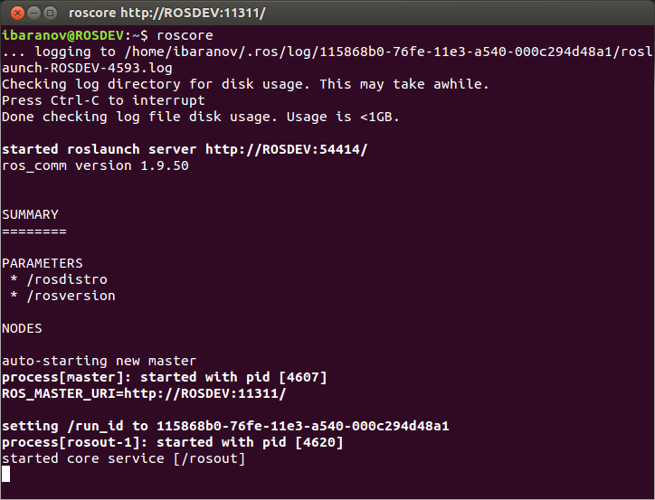
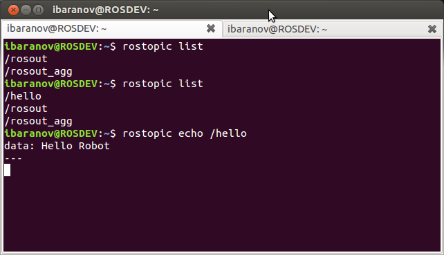
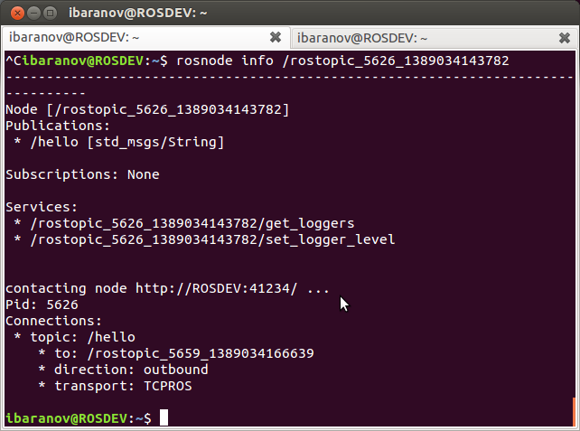

Practical Example
====================

Now that you understand the basics, here’s how they can apply to a practical example.
Follow along to see how we actually ‘do’ all of these things….

1. First, you will need to run Ubuntu, and have ROS installed on it. For your convenience, you can download our easy-to-use image here:

  https://s3.amazonaws.com/CPR_PUBLIC/LEARN_ROS/ROS_Edu.zip

  **Login (username):** user

  **Password:** learn

2. Get VMWare Player, and use the virtual disk above. If you don’t want to use the provided image, or are not using a virtual machine, follow the tutorial here (after installing Ubuntu 16.04): http://wiki.ros.org/kinetic/Installation/Ubuntu

  Throughout the rest of the tutorials, we will be referencing the ROS cheatsheet available `here <http://bit.ly/1RCVMaB>`_.

3. Open a new Terminal Window (Ctrl + Alt + T). In the new terminal, type ``roscore`` and press ENTER. You should see output in the terminal similar to the image below.

If you did not see this, run ``source /opt/ros/kinetic/setup.bash`` and then run ``roscore`` again.

What you have just done is started the ROS Master as we described above. We can now experiment with some ROS commands.

Open a new **Terminal**, and type in ``rostopic``. This will give you a list of all the options that the rostopic command can do.

For now, we are interested in rostopic list. Type in ``rostopic list``. (And press enter). This should give you a window like the following:

The two entries listed above are ROS’s built in way of reporting and aggregating debug messages in the system. What we want to do is publish and subscribe to a message.

You can open a new **Terminal** again, or open a new tab on the same terminal window (Ctrl + Shift + T).
In the new Terminal, type in:

.. parsed-literal::

    rostopic pub /hello std_msgs/String "Hello Robot"

Let’s break down the parts of that command.

``rostopic pub`` – This commands ROS to publish a new topic.

``/hello`` – This is the name of the new topic. (Can be whatever you want)

``std_msgs/String`` – This is the topic type. We want to publish a string topic. In our overview examples above, it was an image data type.

``“Hello Robot”`` – This is the actual data contained by the topic. I.E. the message itself.

Going back to the previous Terminal, we can execute rostopic list again.

We now have a new topic listed! We can also echo the topic to see the message by entering ``rostopic echo /hello``.

We have now successfully published a topic with a message, and received that message.  We can also look into the node that is publishing the message.

Type in ``rosnode list``. You will get a list similar to the one below. (The exact numbers beside the rostopic node may be different).  Type **Ctrl + C** to stop echoing the /hello topic.

Because we asked rostopic to publish the /hello topic for us, ROS went ahead and created a node to do so. We can look into details of the node by typing ``rosnode info /rostopic_...(whatever numbers)``

**TIP:** In ROS, and in Linux in general, whenever you start typing something, you can press the Tab key to auto-complete it.
If there is more than one entry, double tap Tab to get the list. In the above example, all I typed was rosnode info /rost(TAB)

If you cancelled your ``rostopic echo /hello`` command, you may not see any connections listed.  This is because nothing is connected to the **/hello topic**, and so there are no connections to show.  If you echo the topic again and re-run ``rosnote info rostopic_<numbers>`` in another terminal window you should see the connection listed.

We can get info on our topic the same way, by typing ``rostopic info /hello``

You will notice that the node listed under “Publishers:” is the same node we requested info about.

Up till now, we have covered the fundamentals of ROS, how to use rostopic, rosnode.

Next time, we will compile a short example program, and try it out.
